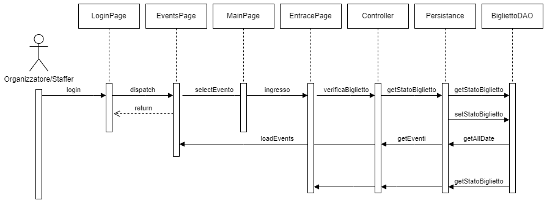

# Diagrammi di Sequenza del Progetto

Descrizione dei diagrammi di sequenza utilizzati nel progetto per illustrare il flusso delle operazioni principali tra gli oggetti. Ogni diagramma rappresenta un'interazione tra i componenti del sistema durante una determinata operazione o scenario.

## 1 Creazione Evento

## 2 Aggiunta Invitato

## 3 Lista Invitati

## 4 Aggiungi Staffer

## 5 Aggiungi Organizzatore

## 6 Modifica Vendite

## 7 Banco Ingresso

## 8 Banco Guardaroba

